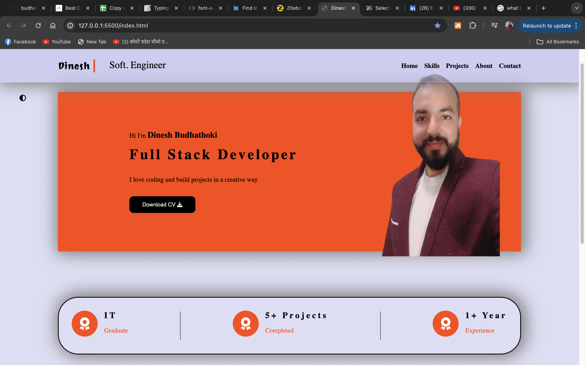

# React Portfilio Website

Welcome to my Portfolio Website repository. This project showcase my professional journey, skills and projects. This website is desined to provide a comprehensive overview of my work and accomplishment in web development.



## Table of Contents

- [Introduction](#introduction)
- [Features](#Features)
- [Technologies Used](#Technologies-Used)
- [How to use](#How-to-use)
- [Uses](#Uses)
- [Project Structure](#project-Structure)
- [Contributing](#Contributing)
- [License](#License)
- [Contact](#contact)
- [Thank you Message](#Thank-you-Message)

## Introduction

This portfolio website serves as a digital resume and project showcase, reflecting my experiencce as a web developer. It includes section for my bio, skills, projects, contat information, and a blog where I share inshights and updates.

[Visit my Live Website](www.dineshbudhathoki.com)

## Features

- **Responsive Design**: Optimized for all devices, including desktops, tablets, and mobile phones.
- **Single Page App**: This website is build using single page app structure. The codebase for the single page is not deployed but the code is available `spa` branch.

## Technologies Used

- **Frontend**:
  - HTML5
  - CSS3
  - ReactJS
  - Bootstrap
- ## **Backend**:
- **Database**:
- **Deployment**:
  - Vercel

## How to use

To set of this project in your device locally, please follow the steps:

1. **Clone the repository**:
   Run the following command in your terminal

```
git clone https://github.com/budhathokidinesh/React-Portfolio.git
```

2. **Navigate to the project repository**:
   Run the following command in your terminal

```
cd React-Portfolio
```

3. **Install the Dependencies**:

```
yarn
```

4. **Run the development server**:

```
yarn dev
```

Note: If you are not using `yarn`, you must install it globally. To install `yarn` globally, run the following command `npm i yarn -g`

## Uses

## Project Structure

```
REACT-PORTFOLIO
|-- public
|-- src
| |--Components
| | |--About.jsx
```

## Contributing

There are many different ways to contribute. If you are interested, check out our contributing guidlines to learn how you an get involved.

## License

This project is licensed under the MIT License. See the [LICENSE] (https://docs.github.com/en/repositories/managing-your-repositorys-settings-and-features/customizing-your-repository/licensing-a-repository) file for more details.

## Contact

If you have any questions or want to get in touch, feel free to reach out:

- Email: physmarika1@gmail.com
- Linkedin:
- Twitter:

## Thank you Message

---

Thank you for visiting my portfolio website repository! I hope you find it informative and engaging. Your feedback ad contributions are highly appreciated.
